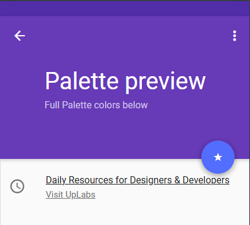
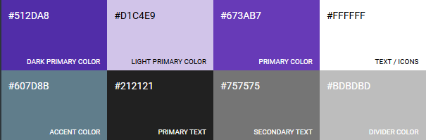

# 📱DSM441 G01T

 

# 🔴🔵 PharmaClick
Bienvenido al repositorio de desarrollo de PharmaClick nuestra aplicacion movil 👋🏻
 
   
<h2>👨🏻‍💻👨🏻‍💻👨🏻‍💻👩🏻‍💻Equipo de Desarrollo </h2>

  <table style={margin: 0 auto}>
  <tr align="center">
    <td>Mariela Isabel Rodríguez</td>
    <td>Nelson Ricardo Murcia</td>
  </tr>
    <tr align="center">
    <td>  :computer: :art: :bulb:</td>
    <td>  :computer: :art: :bulb:</td>
  </tr>
</table>

 

## ⚙️ Herramientas y Tecnologías Utilizadas
<table>

  <tr align="center">
    <td>✅Android studio </td>
    <td>✅Kotlin</td>
    <td>✅Firebase</td>

  </tr>
</table>

## 🎨 Icono y Paleta de Colores

## 📝 Archivos Importantes

🔴[**Video demostrativo 🖌**](https://youtu.be/s2rVodVVbYM) 

🔵[**Documento 📗**](https://drive.google.com/file/d/1DjV9jbOujvsPmF8GS8eXV9bqUgtG6Glz/view?usp=drivesdk)
